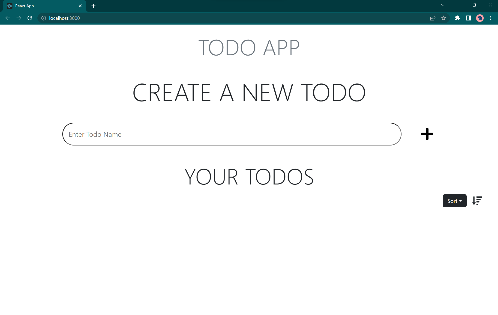
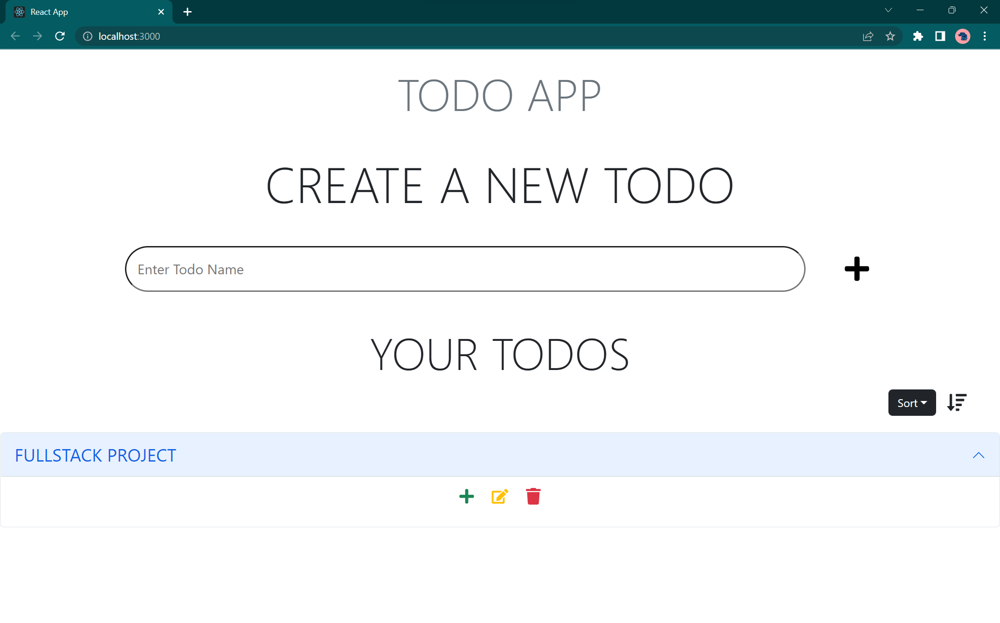

# 📃 Fullstack Todo App

A todo app with APIs to create, edit and delete todos and tasks along with a frontend that uses those APIs.

## Tech Stack

**Client:** React, Bootstrap

**Server:** Node, Express

**Database:** MongoDB

**Backend AaS:** appwrite

## Environment Variables

To run this project, you will need to add the following environment variables to your .env file (sample data is given at backend/.env_example)

> Backend

`PORT`
`MONGO_URI`

> Frontend

`PROJECT_ID`

## Installation

Use the below steps to setup this project on your local system.

- Clone this git repository

```bash
git clone https://github.com/prateek-budhiraja/todofs.git
```

- After cloning the make sure you have mongodb installed and configured on your system.

- Go to the backend folder, and rename `.env_example` file to `.env`.

- Change the environment variable value if required (to match your setup).

- To setup backend server, use the below commands

```bash
cd todofs/backend
npm install
npm run dev
```

- Now the backend would be running at http://localhost:4000/ (if port is not changed in .env file)
- To setup frontend, use the below commands

- First install appwrite in docker and setup in your system. (follow the [documentaion](https://appwrite.io/) or follow this [video](https://youtu.be/pOqT7yczlj4))

- After appwrite is setup and new project is created, follow the below steps.

```bash
cd ../frontend
npm install
```

- Go to src > appwrite
- Create a new file called `setup.js` and replace your appwrite project id below.

```js
export default {
	PROJECT_ID: "<YOUR_PROJECT_ID>",
};
```

```bash
npm start
```

- Now the frontend would be accessable at http://localhost:3000/

## Screenshots




