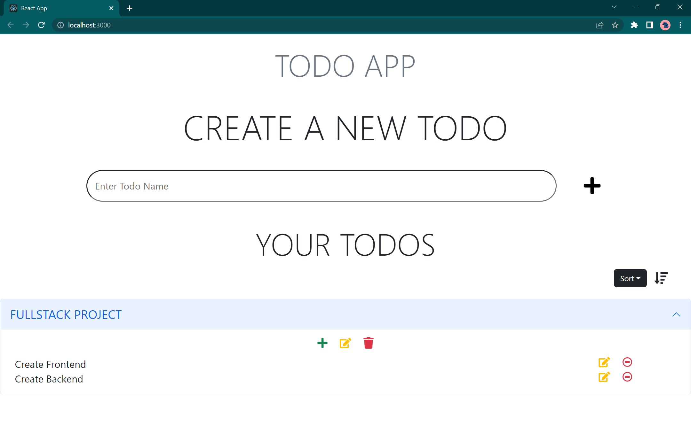

# 📃 Fullstack Todo App

A todo app with APIs to create, edit and delete todos and tasks along with a frontend that uses those APIs.

## Tech Stack

**Client:** React, Bootstrap

**Server:** Node, Express

**Database:** MongoDB

## Environment Variables

To run this project, you will need to add the following environment variables to your .env file (sample data is given at backend/.env_example)

`PORT`
`MONGO_URI`

## Installation

Use the below steps to setup this project on your local system.

- Clone this git repository

```bash
git clone https://github.com/prateek-budhiraja/todofs.git
```

- After cloning the make sure you have mongodb installed and configured on your system.

- Go to the backend folder, and rename `.env_example` file to `.env`.

- Change the environment variable value if required (to match your setup).

- To setup backend server, use the below commands

```bash
cd todofs/backend
npm install
npm run dev
```

- Now the backend would be running at http://localhost:4000/ (if port is not changed in .env file)
- To setup frontend, use the below commands

```bash
cd ../frontend
npm install
npm start
```

- Now the frontend would be accessable at http://localhost:3000/

## Branches

> appwrite

This branch is the extension of main branch, that implements login functionality using [appwrite](https://appwrite.io/).

Change the branch and see the instructions on how to configure appwrite with this project.

## Screenshots



